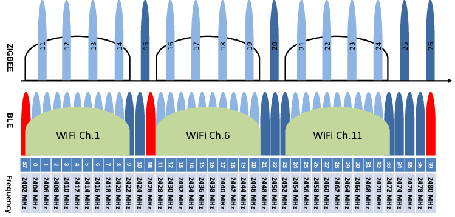

# RGB Spectrum Analyzer

[中文版](README_CN.md)

A simple 2.4GHz Spectrum Analyzer RGB Strip Light based on nRF52832 (used as decoration or toy)
Project largely based on: https://github.com/hb020/pixlAnalyzer (Thanks to [hb020](https://github.com/hb020) and [atc1441](https://github.com/atc1441))
Inspired by: https://youtu.be/moBCOEiqiPs?si=ToIqUjC3-g4FUg77

## Version history

2026-02-19: First release

## Development

You can use VS Code with OpenOCD for debugging. The `.vscode/` directory is already configured, but you may need to adjust it according to your platform and system.

## Flashing

Use SWD interface

## Compiling

It is currently made for MacOS, some changes might be needed to run on Linux and Windows.
You need to have installed:

* `make`
* `gcc-arm-none-eabi`
  * Depending on your OS, set the path to the gcc's bin folder in the `/RGBSA/firmware/sdk/components/toolchain/gcc/Makefile.posix` or `.../Makefile.windows` file.
  * Example for MacOS: `GNU_INSTALL_ROOT ?= /Applications/ArmGNUToolchain/14.2.rel1/arm-none-eabi/bin/`

## Frequency range and channels

The 2.4GHz ISM band is divided into several channels, different protocols use different channels. Here are some common channel allocations:

| Center Frequency (MHz) | IEEE 802.15.4 channel, 5MHz wide | 802.11b/g/n WiFi channel, 22/20/40MHz wide | BLE channel, 2MHz wide |
|:----:|:--:|:--:|:--:|
| 2400 |    |    |    |
| 2401 |    |    |    |
| 2402 |    |    | 37 |
| 2403 |    |    |    |
| 2404 |    |    | 0  |
| 2405 | 11 |    |    |
| 2406 |    |    | 1  |
| 2407 |    |    |    |
| 2408 |    |    | 2  |
| 2409 |    |    |    |
| 2410 | 12 |    | 3  |
| 2411 |    |    |    |
| 2412 |    |  1 | 4  |
| 2413 |    |    |    |
| 2414 |    |    | 5  |
| 2415 | 13 |    |    |
| 2416 |    |    | 6  |
| 2417 |    |  2 |    |
| 2418 |    |    | 7  |
| 2419 |    |    |    |
| 2420 | 14 |    | 8  |
| 2421 |    |    |    |
| 2422 |    |  3 | 9  |
| 2423 |    |    |    |
| 2424 |    |    | 10 |
| 2425 | 15 |    |    |
| 2426 |    |    | 38 |
| 2427 |    | (4)|    |
| 2428 |    |    | 11 |
| 2429 |    |    |    |
| 2430 | 16 |    | 12 |
| 2431 |    |    |    |
| 2432 |    |  5 | 13 |
| 2433 |    |    |    |
| 2434 |    |    | 14 |
| 2435 | 17 |    |    |
| 2436 |    |    | 15 |
| 2437 |    |  6 |    |
| 2438 |    |    | 16 |
| 2439 |    |    |    |
| 2440 | 18 |    | 17 |
| 2441 |    |    |    |
| 2442 |    |  7 | 18 |
| 2443 |    |    |    |
| 2444 |    |    | 19 |
| 2445 | 19 |    |    |
| 2446 |    |    | 20 |
| 2447 |    |  8 |    |
| 2448 |    |    | 21 |
| 2449 |    |    |    |
| 2450 | 20 |    | 22 |
| 2451 |    |    |    |
| 2452 |    |  9 | 23 |
| 2453 |    |    |    |
| 2454 |    |    | 24 |
| 2455 | 21 |    |    |
| 2456 |    |    | 25 |
| 2457 |    |(10)|    |
| 2458 |    |    | 26 |
| 2459 |    |    |    |
| 2460 | 22 |    | 27 |
| 2461 |    |    |    |
| 2462 |    | 11 | 28 |
| 2463 |    |    |    |
| 2464 |    |    | 29 |
| 2465 | 23 |    |    |
| 2466 |    |    | 30 |
| 2467 |    | 12 |    |
| 2468 |    |    | 31 |
| 2469 |    |    |    |
| 2470 | 24 |    | 32 |
| 2471 |    |    |    |
| 2472 |    | 13 | 33 |
| 2473 |    |    |    |
| 2474 |    |    | 34 |
| 2475 | 25 |    |    |
| 2476 |    |    | 35 |
| 2477 |    |    |    |
| 2478 |    |    | 36 |
| 2479 |    |    |    |
| 2480 | 26 |    | 39 |
| 2481 |    |    |    |
| 2482 |    |    |    |
| 2483 |    |    |    |
| 2484 |    | 14 |    |
| 2485 |    |    |    |
| 2486 |    |    |    |
| 2487 |    |    |    |

## SDK links for the nRF52832

* [nRF52832 Product Specification v1.9](https://docs.nordicsemi.com/bundle/nRF52832_PS_v1.9/resource/nRF52832_PS_v1.9.pdf)
* [RADIO — 2.4 GHz Radio](https://docs.nordicsemi.com/bundle/ps_nrf52832/page/radio.html)
* [SAADC — Successive approximation analog-to-digital converter](https://docs.nordicsemi.com/bundle/ps_nrf52832/page/saadc.html)
