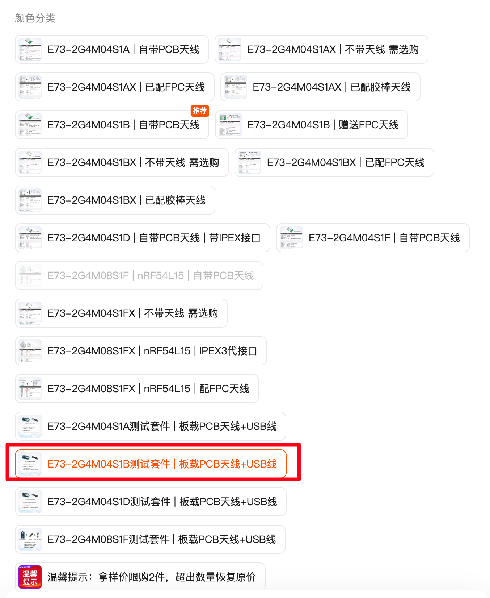
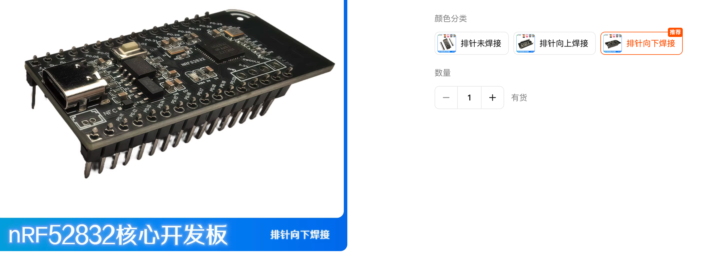
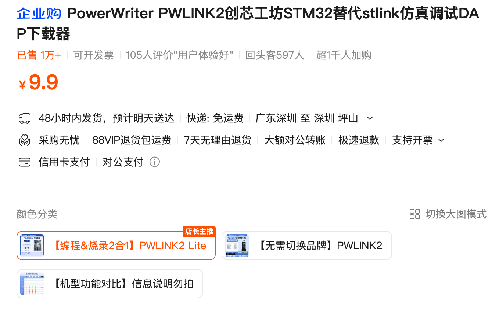
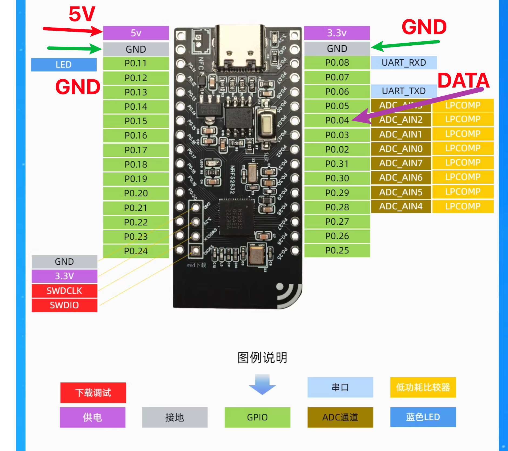
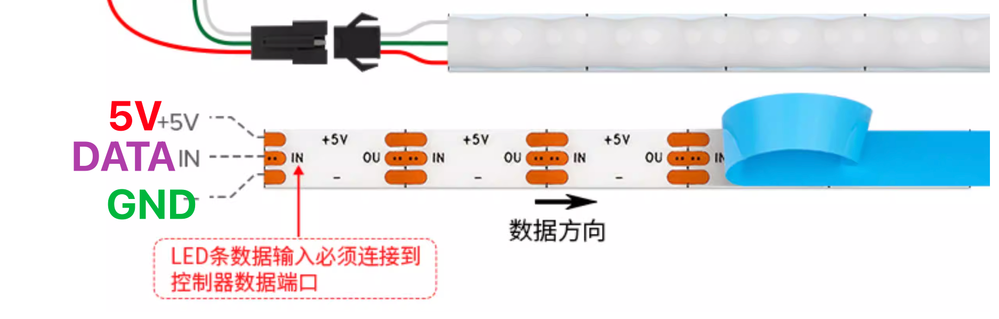

# RGBSA图文教程

> 主播暂时没有售卖该装置的意向。为感兴趣但是没有电子经验的朋友准备一份详细教程。

## 购买材料

### 1. **nrf52832开发板**

- 只要确定是**nrf52832**、带USB（供电）、带5V输出的开发板就可以

  - 比如亿百特的开发板，性价比比较高，但是尺寸比较大，一定要S1B后缀才是nrf52832的

  

  - 又比如沃态科技的开发板，相对小巧一点，也是视频里使用的同款

  

### **2. RGB灯带**

- 必须是WS2812B协议的灯带、5V供电。

- 灯珠数量和长度可以自己选择。灯带的宽度、每米灯珠数量受灯珠封装影响，自己喜欢就行。

- 总灯珠数量尽量控制在160以下。多了功耗太大，开发板的5V输出可能带不动（而且也会特别长），太过少了分辨率低（比如只有十几颗灯珠），我建议在100～160。

  

  这些都是可以的，只要确定是5V的WS2812B就可以，可以按心仪的长度买、或者按颗数买、或者按密度和长度买。然后接口的话如果能找到杜邦线接口的就后续接线可能方便一点。否则可能需要焊接（那就需要电烙铁了）。

### 3. 灯带支架（可选）

- 可以是2020铝型材（某宝定制长度就行）或者专门的灯带支架，或者不用都可以，不是必备的。

### **4. 烧录器**

- 如果不是专门做嵌入式开发，估计手边没有烧录器，可以买一个性价比的烧录器以控制成本。比如

  

  不过主播没用过这款，遇到问题可能需要咨询一下客服要教程

- 主播用的是稚晖君的ultraLink，稍贵。

---


## 电路连接





- 只需要将对应接口连起来就行，5V连接5V、灯带的DATA连接开发板的DATA（P0.04 程序定义的）、GND连接GND

> [!IMPORTANT]
>
> WS2812B是有方向性的，注意开发板一定是连接灯带的数据输入方向（IN），如果连接到输出方向，也没什么关系，只是灯带不亮而已，重新连接就好。

> [!WARNING]
>
> 5V和GND不要反，有些设计可能中间是5V，一般设计中间数据线，红色是5V。但是也有不一样的，需要确认好，不确定的话跟客服确认。接反了会烧。

- 连接方法：如果是2.54杜邦线接口的直接连接就可以，如果不是的需要用剪刀把线束剥开然后用电烙铁和焊锡焊接到对应位置。电烙铁使用可能需要一点点练习，如果没有经验可以到视频网站找找教程。


## 程序烧录

- nRF52832使用SWD接口作为调试接口，连接手边的某某Link的SWD接口到开发板的SWD接口（SWD(IO)、SWC(LK)、GND）即可。

- 从开源仓库下载代码。如果没有经验编译固件则可以直接使用仓库中的firmware/build/RGBSA_52832.hex

- 安装openocd，具体教程可以网上查一下，不难的。

- 如果有vscode。仓库共享了vscode的调试烧录配置。如果对程序不感兴趣也可以直接使用命令行：

  ```bash
  openocd -f interface/ultralink-NRF52.cfg -c "init; halt; nrf52_flash_bank_erase 0; flash write_image firmware/build/RGBSA_52832.hex; reset; exit"
  ```

  > [!NOTE]
  >
  > 1. vscode的配置中使用的是Mac环境，如果需要安装编译器或者处于Windows环境，可能需要询问AI获取针对性的支持
  > 2. 命令行默认你已经位于项目根目录，否则“firmware/build/RGBSA_52832.hex”路径需要输入正确的相对路径或者绝对路径
  > 3. 配置以及命令行使用的参数为utlraLink参数，如果使用其他烧录器，需要做对应修改，可以询问AI获得针对性支持。比如“-f interface/ultralink-NRF52.cfg” 可能需要改成 “openocd -f interface/stlink-v2.cfg -f target/nrf52.cfg” （如果使用stlink才这样改）、“-f interface/cmsis-dap.cfg -f target/nrf52.cfg”（如果使用CMSIS-DAP （一般调试器））、“-f interface/jlink.cfg -f target/nrf52.cfg”（如果使用 J-LINK）。

  

  

